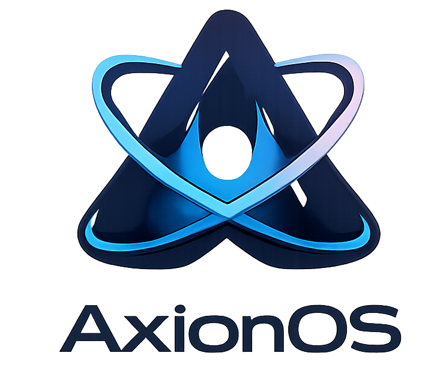

# AxionOS

<div align="center">



### A modern immutable Linux distribution powered by Fedora Atomic, BlueBuild and OCI containers.

[](https://github.com/arso-fr/axionos/actions/workflows/build-image.yml)
[](https://github.com/arso-fr/axionos/actions/workflows/build-and-release-iso.yml)
[](LICENSE)
[](https://fedoraproject.org/atomic-desktops/)
[](https://blue-build.org)

</div>

---

# ✨ About

AxionOS is a custom immutable Linux distribution based on Fedora Atomic technologies and built using BlueBuild.

It focuses on:

- ⚡ Fast and reproducible deployments
- 🔒 Immutable and reliable system updates
- 📦 OCI container-native workflows
- 🧱 Atomic upgrades and rollbacks
- 🎨 Custom branding and desktop experience
- 🚀 Modern Linux development workflow

AxionOS is distributed as:
- OCI container images
- bootable ISOs
- signed system images

---

# � Éditions AxionOS

AxionOS est conçu comme une plateforme entreprise modulaire avec plusieurs éditions :

- `recipes/axion-os-desktop.yaml` : édition Desktop immuable basée sur `silverblue`
- `recipes/axion-os-wsl-dev.yaml` : édition WSL basée sur `ucore` pour le développement
- `recipes/axion-os-server.yaml` : édition Server basée sur `ucore` pour les charges de production

Chaque édition repose sur une base propre et conserve le nécessaire pour être légère, rapide et adaptée à son usage.

## Construire une édition

Pour générer une image à partir d'une recette BlueBuild :

```bash
blue-build --recipe recipes/axion-os-server.yaml
```

Pour WSL :

```bash
blue-build --recipe recipes/axion-os-wsl-dev.yaml
```

Pour le bureau :

```bash
blue-build --recipe recipes/axion-os-desktop.yaml
```

---

# �🧱 Technologies

AxionOS is powered by:

- Fedora Atomic
- rpm-ostree
- BlueBuild
- bootc
- OCI containers
- GitHub Actions
- Sigstore / Cosign

---

# 📦 Installation

> [!WARNING]
> AxionOS is currently experimental.
> Use at your own discretion.

## Rebase an existing Fedora Atomic installation

### 1. Rebase to the unsigned image

```bash
rpm-ostree rebase ostree-unverified-registry:ghcr.io/arso-fr/axionos:latest
